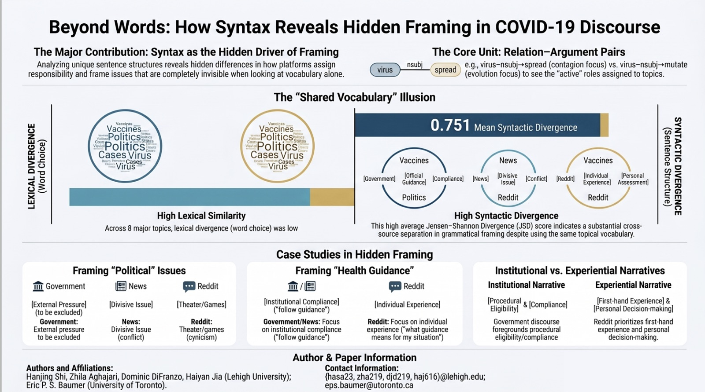

# Exploring COVID-19 Framing Across Diverse Platforms

This repository contains code, reproducibility notes, and shareable derived materials for the paper:

**"Exploring COVID-19 Framing Across Diverse Platforms: Analyzing Semantic and Contextual Shifts in Public Discussion, News Media, and Government Communication"**

Accepted at the **Twentieth International AAAI Conference on Web and Social Media (ICWSM 2026)**.



The infographic above is a project overview image adapted from an earlier project presentation. It is included to summarize the analytic idea, not as the final presented ICWSM 2026 presentation.

## Project Overview

The paper studies how COVID-19 topics were framed across three communication sources:

- Reddit public discussion
- mainstream news articles
- government and public health communication

The central claim is that cross-source differences are not only about which topics each source discusses. Even when sources use overlapping COVID-19 vocabularies, they can frame the same topic differently through grammatical and narrative structure.

Methodologically, the project uses the Linked Latent Theta Role (LLTR) model as a syntactic lens. We compare source-specific framing distributions by examining how shared topic words are embedded in dependency-based relation-argument evidence, and we quantify cross-source divergence using Jensen-Shannon divergence (JSD).

## Main Findings

Across eight COVID-19 topics, sources often share topic vocabularies but diverge in how they grammatically realize those topics.

Government communication tends to frame issues through institutional and procedural structures, such as reporting, guidance, recommendations, and department-level action.

News discourse often frames the same issues through mediated reporting, attribution, event updates, and evaluative context.

Reddit discourse more often frames the same topics through public sense-making, uncertainty, questioning, interpretation, and everyday decision-making.

One especially interpretable example is Topic 6, **Guidance, Testing, and Cases**. This is an example from the full eight-topic analysis, not the only topic analyzed. In the paper, government and news are relatively similar in syntactic framing for this topic, while Reddit is more distinct:

- Government-News JSD: `0.14`
- News-Reddit JSD: `0.54`
- Government-Reddit JSD: `0.92`

This suggests that communication gaps may arise not only from missing information, but also from how the same information is framed for different audiences.

## Repository Structure

```text
.
├── README.md
├── .gitignore
├── requirements.txt
├── data/
│   ├── README.md
│   └── derived/
├── notebooks/
│   └── README.md
├── results/
│   └── README.md
├── src/
│   └── README.md
└── assets/
    └── README.md
```

## Data Availability

This repository is intended to share code, reproducibility materials, and selected derived results. We do not plan to publish the full raw CSV datasets because some source data may be subject to platform terms, copyright restrictions, or source licensing constraints.

Where possible, this repository should include:

- derived topic-level result tables
- derived JSD result tables
- small sanitized example files needed to understand the analysis
- scripts or notebooks used to reproduce the reported figures
- documentation explaining how restricted data can be reconstructed or requested

See `data/README.md` for details.

## Reproducibility Notes

The original analysis was conducted in Python notebooks with supporting Python scripts. The public version should prioritize a clean reproducibility path:

1. Prepare or reconstruct the source-balanced corpus.
2. Run topic modeling and LLTR-based syntactic framing extraction.
3. Generate topic-level and source-level framing distributions.
4. Compute lexical and syntactic Jensen-Shannon divergence.
5. Reproduce the paper's key figures and tables.

The cleaned final analysis entry point is:

```bash
python src/final_framing_analysis.py
```

## Citation

Formal citation information will be added after the ICWSM 2026 proceedings entry is available.

```bibtex
@inproceedings{shi2026covidframing,
  title = {Exploring COVID-19 Framing Across Diverse Platforms: Analyzing Semantic and Contextual Shifts in Public Discussion, News Media, and Government Communication},
  author = {Shi, Hanjing and Aghajari, Zhila and DiFranzo, Dominic and Jia, Haiyan and Baumer, Eric P. S.},
  booktitle = {Proceedings of the International AAAI Conference on Web and Social Media},
  year = {2026},
  note = {Accepted at ICWSM 2026}
}
```

## Contact

For questions about the repository, please contact Hanjing Shi.
